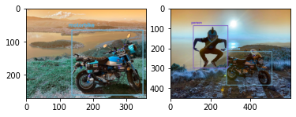
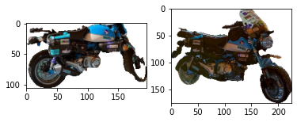

# Image Analysis

Python modeling to support image analysis.

# Preparation


* We are using pre-trained model-weights
  * Xception model for image features extraction, where we are not using the fully-connected
      layer at the top of the network
  * U2net model for image semantic segmentation (someone could also use instance segmentation for same examples)
  * YOLO model in order to detect objects


# Development
### Dependencies

* Install anaconda3

* Activate virtual enviroment
```bash
sudo pip3 install --upgrade virtualenv
mkdir venvs
virtualenv my_venv
source my_venv/bin/activate
```

* Install python libraries
```bash
pip3 install -r requirements.txt
```

* Download and copy pre-trained model weights
  * cp yolo3.weights on src/yolo/saved_models (https://github.com/patrick013/Object-Detection---Yolov3/tree/master/model)
  * cp u2net.pth on src/u2net/saved_models/u2net (https://drive.google.com/uc?id=1ao1ovG1Qtx4b7EoskHXmi2E9rp5CHLcZ)
# Image Analysis
Following, we report several examples, which are also analysed on image analysis Jupyter notebook

### Objects similarity
Following we see two cars which should be quite similar.


After extracting Image features, we calculate the cosine similarity, which is very low (0.23)

Thus, we firstly calculate the semantic segmentation of the images.


Next, we detect contours based on Image segmentation, taking only contours that have big enough countour Area, and we reconstruct contour Images.
After taking new image features, the new features' cosine similarity is 0.63


### Objects colour comparison

Using the segmented area as a mask, we can take the difference of the RGB averages of the two images, which as it was expected is quite low. 

[[-1.01],
[-0.80],
[-5.17]]

### Objects detection

Following, in those two pictures YOLO algorith correctly detects all objects in the pictures.


And segmentation will indicate two main objects in the second picture.


Thus, someone could use an algorithm to exclude particular fields (such as "Person") and for example proceed on image objects' similarity only with non-Person objects of images.



